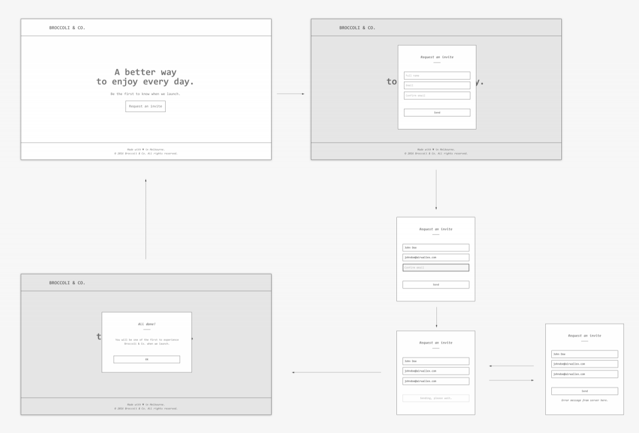

# Airwallex test
## Checklist

UI:

- [ ] The UI should occupy the full height of the screen.
- [ ] Shows a fixed header that is always on top of the window and a footer that is always on the bottom of the window (assuming a reasonable window height).
- [ ] The page content is sandwiched in the middle, containing just a heading, a small piece of text and a button to request an invite.
- [ ] A rough mockup of the basic layout is attached. While preserving this layout on desktop, you may style it however you wish, with or without images.

Behavior/Validation
- [ ] When the Request Invite button is clicked, a popup shows containing the input fields.
- [ ] Full name Email Confirm Email The user needs to fill in all three fields to request an invite. needs to be at least 3 characters long, needs to be in Full name Email validation email format and needs to match Confirm Email .
- [ ] Email If the user clicks and one or more fields do not validate properly, the app should contact the backend but instead highlight the Send not invalid field(s).
- [ ] If the user clicks Send and all fields validate properly, the app should send the request to the backend server (see specs below) and Send inform the user that the request is being sent.
- [ ] If the server returns 200 OK, it should switch to another popup, indicating that everything went through OK. This popup can be dismissed and will simply close - revealing the homepage again.
- [ ] The server may return 400 Bad Request, in which case the app should simply display the error message from the server.
- [ ] The Send button can be clicked again to re-attempt the submission.

Tooling
- [x] The solution must use a modern front-end framework, preferably Angular (1 or 2) or **React**.
- [x] The solution must use a modern CSS extension language, preferably **Sass**.
- [x] The solution must be mobile friendly (users won't need to pinch and zoom on thexr mobile devices).
- [x] The solution must use a modern build tool, preferably **Webpack**.
- [ ] The solution should use **flexbox** layout where appropriate (basic page layout, positioning elements, anything relevant.; we do not support browsers that do not support flexbox).
- [x] The solution should be in ES6 though **Typescript** / Flow are preferred if appropriate.

#### scripts, kinda self-explained
```
npm i
npm run dev
npm run build
npm run test
```

